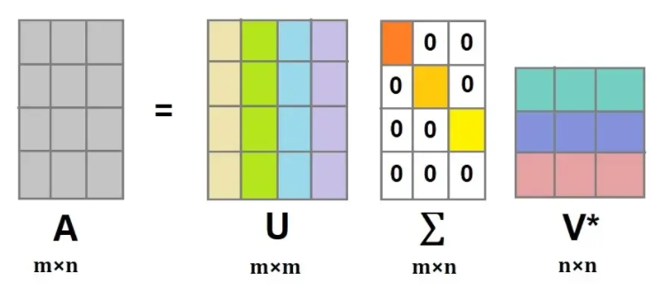

# SVD(Singular Value Decomposition, 특잇값 분해)

행렬을 특정한 구조로 분해하는 방식입니다.

## Matrix Factorization(MF)
선형대수학 수업시간에 배웠던 LU Factorization 개념과 비슷하게 생겼습니다.

LU Factorization을 간단히 나타내면 다음과 같습니다.
$ A = LU $

행렬 A를 LU로 분해하는 방법으로, L은 하삼각행렬, U는 상삼각행렬입니다.
L은 대각선 성분이 모두 1이고, 그 위는 전부 0, 그 아래는 non zero인 단위하삼각행렬입니다.
U는 